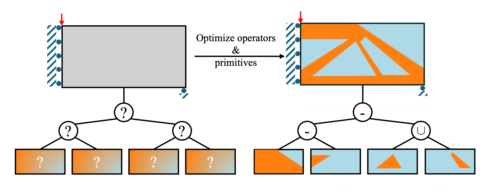

# [TreeTOp: Topology Optimization using Constructive Solid Geometry Trees](https://arxiv.org/abs/2409.02300)

[Rahul Kumar Padhy](https://sites.google.com/view/rahulkp/home), Pramod Thombre, [Krishnan Suresh](https://ersl.wisc.edu/research.html), [Aaditya Chandrasekhar](https://www.aadityacs.com/)


## Abstract

Feature-mapping methods for topology optimization (FMTO) facilitate direct geometry extraction by leveraging high-level geometric descriptions of the designs. However, FMTO often relies solely on Boolean unions, which can restrict the design space. This work proposes an FMTO framework leveraging an expanded set of Boolean operations, namely, union, intersection, and subtraction. The optimization process entails determining the primitives and the optimal Boolean operation tree. In particular, the framework leverages a recently proposed unified Boolean operation approach. This approach presents a continuous and differentiable function that interpolates the Boolean operations, enabling gradient-based optimization. The proposed methodology is agnostic to the specific primitive parametrization and is showcased through various numerical examples.



## Citation

```

@article{padhy2024treetop,
  title={TreeTOp: Topology Optimization using Constructive Solid Geometry Trees},
  author={Padhy, Rahul Kumar and Thombre, Pramod and Suresh, Krishnan and Chandrasekhar, Aaditya},
  journal={arXiv preprint arXiv:2409.02300},
  year={2024}
}
```
